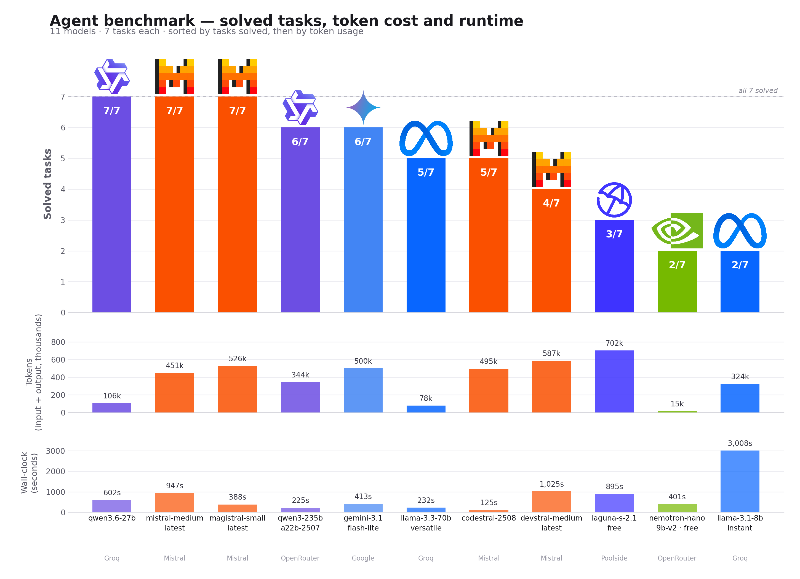

# Benchmark Report

## 1. Setup

**Models compared** (11, across 5 providers):

| Model | Provider | Role |
|---|---|---|
| `mistral-medium-latest` | Mistral | pilot model, first tested |
| `magistral-small-latest` | Mistral | configured default for SWE-bench (`benchmark_defaults.swebench`) |
| `qwen/qwen3.6-27b` | Groq | added for provider/family diversity |
| `qwen/qwen3-235b-a22b-2507` | OpenRouter | larger sibling of the Groq Qwen, for a size comparison within one family |
| `gemini-3.1-flash-lite` | Google | Google's free tier is Flash-family only — Pro requires billing (see §3) |
| `codestral-2508` | Mistral | code-specialised, configured default for MBPP |
| `llama-3.3-70b-versatile` | Groq | |
| `devstral-medium-latest` | Mistral | code-specialised |
| `poolside/laguna-s-2.1:free` | Poolside | coding-focused startup model |
| `llama-3.1-8b-instant` | Groq | smallest model in the pool, for a capability floor |
| `nvidia/nemotron-nano-9b-v2:free` | OpenRouter | |

Two additional models were tried and **discarded before completing a full run** — kept here for transparency rather than dropped silently:

- **`gemini-3.6-flash`** (Google): 0/7. The very first task burned 20 iterations before the single API key got rate-limited; every task after that failed instantly (0 iterations, ~148s each) because the key never recovered within the session. This is a provider-side lockout, not a capability failure — see §3.
- **`gemma-4-31b-it`** (Google): abandoned mid-run. Its responses embed a `<thought>...</thought>` reasoning trace directly inside the completion content (the same failure family documented in §6.1), and the one task it was given took over 6 minutes without finishing — pulled before it produced usable data.

**Tasks** (7, the pool documented in `Q14_TASK_POOL.md`):

| # | Task | Source | Difficulty |
|---|---|---|---|
| 1 | `sympy__sympy-14711` | Subject's own suggestion (p.21) | `<15 min fix` |
| 2 | `sympy__sympy-13480` | Subject's own suggestion (p.21) | `<15 min fix` |
| 3 | `pydata__xarray-4629` | Subject's own suggestion (p.21) | `<15 min fix` |
| 4 | `django__django-11066` | `moulinette`'s `EXAM_POOL` (verified solvable by reference models) | `<15 min fix` |
| 5 | `sympy__sympy-18189` | `moulinette`'s `EXAM_POOL` | `<15 min fix` |
| 6 | `scikit-learn__scikit-learn-13439` | `moulinette`'s `EXAM_POOL` | `<15 min fix` |
| 7 | `scikit-learn__scikit-learn-13779` | `moulinette.list_instances(exclude_exam_pool=True)`, same difficulty tier | `<15 min fix` |

Repo spread: sympy ×3, scikit-learn ×2, django ×1, xarray ×1. All backing `solution.json` files live at `benchmarks/runs/<model-slug>/<task_id>.json`, produced by `benchmarks/swe-matrix.sh`; per-model summaries are duplicated at `models_pool/<model-slug>.md` for quick reading.

## 2. Results

### 2.1 Aggregate

| Model | Provider | Solved | Total input tokens | Total output tokens | Total wall-clock |
|---|---|---|---|---|---|
| `mistral-medium-latest` | Mistral | 7/7 | 447,098 | 3,539 | 947s |
| `magistral-small-latest` | Mistral | 7/7 | 520,328 | 6,006 | 388s |
| `qwen/qwen3.6-27b` | Groq | 7/7 | 101,022 | 4,970 | 602s |
| `qwen/qwen3-235b-a22b-2507` | OpenRouter | 6/7 | 342,042 | 2,420 | 225s |
| `gemini-3.1-flash-lite` | Google | 6/7 | 492,995 | 7,337 | 413s |
| `codestral-2508` | Mistral | 5/7 | 491,593 | 3,333 | 125s |
| `llama-3.3-70b-versatile` | Groq | 5/7 | 77,344 | 813 | 232s |
| `devstral-medium-latest` | Mistral | 4/7 | 582,465 | 4,503 | 1,025s |
| `poolside/laguna-s-2.1:free` | Poolside | 3/7 | 692,208 | 9,811 | 895s |
| `llama-3.1-8b-instant` | Groq | 2/7 | 319,054 | 4,769 | 3,008s |
| `nvidia/nemotron-nano-9b-v2:free` | OpenRouter | 2/7 | 11,597 | 3,309 | 401s |

### 2.2 Visualisation



### 2.3 Full per-task detail

| Model | Task | Solved | Iterations | Input tokens | Output tokens | Wall-clock | Error |
|---|---|---|---|---|---|---|---|
| mistral-medium-latest | sympy-14711 | yes | 24 | 159,280 | 1,298 | 316s | |
| mistral-medium-latest | sympy-13480 | yes | 4 | 5,064 | 99 | 12s | |
| mistral-medium-latest | xarray-4629 | yes | 5 | 12,392 | 141 | 11s | |
| mistral-medium-latest | django-11066 | yes | 5 | 13,326 | 124 | 34s | |
| mistral-medium-latest | sympy-18189 | yes | 4 | 8,838 | 201 | 45s | |
| mistral-medium-latest | scikit-learn-13439 | yes | 21 | 235,537 | 1,428 | 514s | |
| mistral-medium-latest | scikit-learn-13779 | yes | 6 | 12,661 | 248 | 14s | |
| magistral-small-latest | sympy-14711 | yes | 15 | 58,623 | 994 | 20s | |
| magistral-small-latest | sympy-13480 | yes | 4 | 5,064 | 99 | 12s | |
| magistral-small-latest | xarray-4629 | yes | 15 | 62,183 | 2,321 | 54s | |
| magistral-small-latest | django-11066 | yes | 4 | 8,718 | 98 | 6s | |
| magistral-small-latest | sympy-18189 | yes | 4 | 8,795 | 122 | 38s | |
| magistral-small-latest | scikit-learn-13439 | yes | 13 | 105,907 | 657 | 66s | |
| magistral-small-latest | scikit-learn-13779 | yes | 25 | 271,038 | 1,715 | 192s | |
| qwen/qwen3.6-27b | sympy-14711 | yes | 5 | 6,683 | 642 | 32s | |
| qwen/qwen3.6-27b | sympy-13480 | yes | 4 | 4,735 | 300 | 19s | |
| qwen/qwen3.6-27b | xarray-4629 | yes | 4 | 8,356 | 402 | 21s | |
| qwen/qwen3.6-27b | django-11066 | yes | 4 | 10,575 | 367 | 57s | |
| qwen/qwen3.6-27b | sympy-18189 | yes | 5 | 11,119 | 1,095 | 81s | |
| qwen/qwen3.6-27b | scikit-learn-13439 | yes | 12 | 38,821 | 868 | 258s | |
| qwen/qwen3.6-27b | scikit-learn-13779 | yes | 9 | 20,733 | 1,296 | 135s | |
| qwen/qwen3-235b-a22b-2507 | sympy-14711 | yes | 5 | 8,459 | 116 | 11s | |
| qwen/qwen3-235b-a22b-2507 | sympy-13480 | yes | 4 | 4,585 | 107 | 21s | |
| qwen/qwen3-235b-a22b-2507 | xarray-4629 | yes | 6 | 17,332 | 96 | 15s | |
| qwen/qwen3-235b-a22b-2507 | django-11066 | yes | 5 | 10,273 | 125 | 19s | |
| qwen/qwen3-235b-a22b-2507 | sympy-18189 | yes | 4 | 7,793 | 110 | 42s | |
| qwen/qwen3-235b-a22b-2507 | scikit-learn-13439 | yes | 7 | 14,906 | 152 | 15s | |
| qwen/qwen3-235b-a22b-2507 | scikit-learn-13779 | no | 28 | 278,694 | 1,714 | 101s | input-token budget guard, step 29 |
| gemini-3.1-flash-lite | sympy-14711 | yes | 17 | 104,562 | 1,441 | 42s | |
| gemini-3.1-flash-lite | sympy-13480 | yes | 10 | 21,629 | 582 | 62s | |
| gemini-3.1-flash-lite | xarray-4629 | no | 1 | 1,890 | 421 | 22s | empty completion |
| gemini-3.1-flash-lite | django-11066 | yes | 18 | 117,575 | 1,533 | 83s | |
| gemini-3.1-flash-lite | sympy-18189 | yes | 7 | 22,226 | 448 | 44s | |
| gemini-3.1-flash-lite | scikit-learn-13439 | yes | 13 | 101,743 | 1,453 | 44s | |
| gemini-3.1-flash-lite | scikit-learn-13779 | yes | 20 | 123,370 | 1,459 | 116s | |
| codestral-2508 | sympy-14711 | no | 30 | 147,955 | 1,318 | 24s | 30 iterations, no `final_answer()` |
| codestral-2508 | sympy-13480 | yes | 4 | 4,614 | 87 | 15s | |
| codestral-2508 | xarray-4629 | yes | 4 | 8,039 | 135 | 8s | |
| codestral-2508 | django-11066 | yes | 4 | 7,806 | 103 | 6s | |
| codestral-2508 | sympy-18189 | yes | 4 | 8,272 | 152 | 38s | |
| codestral-2508 | scikit-learn-13439 | yes | 7 | 17,363 | 231 | 10s | |
| codestral-2508 | scikit-learn-13779 | no | 22 | 297,544 | 1,307 | 24s | input-token budget guard, step 23 |
| llama-3.3-70b-versatile | sympy-14711 | no | 0 | 0 | 0 | 0s | container did not start in 30s |
| llama-3.3-70b-versatile | sympy-13480 | yes | 3 | 3,108 | 51 | 10s | |
| llama-3.3-70b-versatile | xarray-4629 | yes | 7 | 19,119 | 119 | 47s | |
| llama-3.3-70b-versatile | django-11066 | yes | 5 | 10,674 | 98 | 26s | |
| llama-3.3-70b-versatile | sympy-18189 | yes | 5 | 11,430 | 168 | 53s | |
| llama-3.3-70b-versatile | scikit-learn-13439 | yes | 6 | 14,662 | 120 | 39s | |
| llama-3.3-70b-versatile | scikit-learn-13779 | no | 6 | 18,351 | 257 | 57s | all keys rate limited |
| devstral-medium-latest | sympy-14711 | no | 26 | 291,375 | 2,176 | 297s | input-token budget guard, step 27 |
| devstral-medium-latest | sympy-13480 | yes | 3 | 3,155 | 56 | 21s | |
| devstral-medium-latest | xarray-4629 | no | 30 | 256,767 | 1,694 | 388s | 30 iterations, no `final_answer()` |
| devstral-medium-latest | django-11066 | yes | 3 | 5,394 | 62 | 28s | |
| devstral-medium-latest | sympy-18189 | yes | 3 | 5,896 | 154 | 138s | |
| devstral-medium-latest | scikit-learn-13439 | no | 0 | 0 | 0 | 6s | empty completion |
| devstral-medium-latest | scikit-learn-13779 | yes | 9 | 19,878 | 361 | 147s | |
| poolside/laguna-s-2.1 | sympy-14711 | no | 30 | 68,083 | 1,090 | 104s | 30 iterations, no `final_answer()` |
| poolside/laguna-s-2.1 | sympy-13480 | yes | 10 | 19,423 | 326 | 34s | |
| poolside/laguna-s-2.1 | xarray-4629 | yes | 25 | 101,295 | 1,444 | 141s | |
| poolside/laguna-s-2.1 | django-11066 | no | 27 | 292,437 | 2,868 | 284s | input-token budget guard, step 28 |
| poolside/laguna-s-2.1 | sympy-18189 | no | 30 | 95,335 | 2,945 | 198s | 30 iterations, no `final_answer()` |
| poolside/laguna-s-2.1 | scikit-learn-13439 | yes | 10 | 59,952 | 526 | 45s | |
| poolside/laguna-s-2.1 | scikit-learn-13779 | no | 30 | 55,683 | 612 | 89s | 30 iterations, no `final_answer()` |
| llama-3.1-8b-instant | sympy-14711 | no | 19 | 44,318 | 1,012 | 423s | HTTP 413 (payload too large) |
| llama-3.1-8b-instant | sympy-13480 | yes | 3 | 3,100 | 38 | 18s | |
| llama-3.1-8b-instant | xarray-4629 | no | 29 | 87,147 | 887 | 825s | wall-clock budget guard, step 29 |
| llama-3.1-8b-instant | django-11066 | no | 5 | 12,416 | 586 | 87s | HTTP 413 |
| llama-3.1-8b-instant | sympy-18189 | no | 16 | 49,111 | 642 | 500s | HTTP 413 |
| llama-3.1-8b-instant | scikit-learn-13439 | yes | 20 | 65,960 | 1,006 | 659s | |
| llama-3.1-8b-instant | scikit-learn-13779 | no | 20 | 57,002 | 598 | 496s | HTTP 413 |
| nvidia/nemotron-nano-9b-v2:free | sympy-14711 | no | 0 | 0 | 0 | 36s | empty completion |
| nvidia/nemotron-nano-9b-v2:free | sympy-13480 | no | 0 | 0 | 0 | 39s | empty completion |
| nvidia/nemotron-nano-9b-v2:free | xarray-4629 | yes | 2 | 3,774 | 1,091 | 26s | |
| nvidia/nemotron-nano-9b-v2:free | django-11066 | yes | 2 | 3,613 | 652 | 19s | |
| nvidia/nemotron-nano-9b-v2:free | sympy-18189 | no | 2 | 4,210 | 1,566 | 170s | empty completion |
| nvidia/nemotron-nano-9b-v2:free | scikit-learn-13439 | no | 0 | 0 | 0 | 55s | empty completion |
| nvidia/nemotron-nano-9b-v2:free | scikit-learn-13779 | no | 0 | 0 | 0 | 56s | empty completion |

### 2.4 MBPP

The matrix above is SWE-bench only. MBPP was measured separately, over the whole
257-task `test` split rather than a sample, under the subject's MBPP ceilings
(10 iterations, 6 000 input tokens, 1 500 output tokens, 120 s per task). Three
Mistral models, one pass each, same commit:

| Model | Passing | Stopped by a budget guard | Input tokens | Output tokens | s/task |
|---|---|---|---|---|---|
| `mistral-medium-latest` | **238 / 257** | 10 | 463,164 | 78,271 | 3.4 |
| `magistral-small-latest` | 215 / 257 | 35 | 609,918 | 84,823 | 3.2 |
| `codestral-2508` | 207 / 257 | 41 | 557,553 | 68,927 | 3.3 |

`mistral-medium-latest` is ahead on every axis at once, and the failure sets say
the gap is structural rather than a lucky pass: 16 tasks defeat all three, and
**no task fails for `mistral-medium-latest` alone**, against 13 for
`magistral-small-latest` and 20 for `codestral-2508`. Its 19 failures are a
subset of what the other two already miss.

**The ceiling decides more than the model does.** Budget-guard exits track the
score almost exactly — 10 exits for 238 passes, 35 for 215, 41 for 207 — and
nearly all of them are the 6 000-token input ceiling reached before the run
converges, not a wrong answer submitted and refused. Across all three passes the
binding constraint on MBPP is how much transcript a task costs, so the headroom
left in this harness is in `agent/history.py`'s compaction, not in the model
list. That is the opposite of the SWE-bench picture in §5, where prompt and tool
design moved the score.

**These scores come from `moulinette_eval validate mbpp`, not from the `success`
field of the solution files, and the two disagree.** A task dump carries only the
public assertions, so the harness validates a submission against a subset of what
finally judges it: the agents claimed 247, 222 and 216 successes where 238, 215
and 207 hold up — 9, 7 and 9 false positives, a consistent ~3 % overstatement
that is a property of the public subset rather than of any model. Task 20 is the
clean case. Both assertions it ships are negative (`is_woodall(254) == False`,
`is_woodall(200) == False`), so a solution computing `k * (2**k - 1)` instead of
Woodall's `k * 2**k - 1` satisfies everything it was given and still fails. No
MBPP figure anywhere in this report is a `success` count.

`mistral-medium-latest` is what `models.json` configures under
`benchmark_defaults.mbpp`. Backing files: the 771 solution files under
`benchmarks/mbpp/<model>/`, the 257 task dumps under `benchmarks/mbpp/tasks/`,
and one `benchmarks/mbpp/<model>-validation.txt` per pass carrying the per-task
verdict and the list of failing ids.

## 3. Provider reliability

| Provider | Models tested | What broke, concretely |
|---|---|---|
| **Mistral** | mistral-medium, magistral-small, codestral, devstral | Single API key hit the per-second free-tier limit hard on `mistral-medium-latest`/`sympy-14711` earlier in this project (100 retries measured); `devstral-medium-latest` returned an outright empty completion once on `scikit-learn-13439`. Otherwise stable. |
| **Groq** | llama-3.3-70b, llama-3.1-8b, qwen3.6-27b | `llama-3.1-8b-instant` hit **HTTP 413 (payload too large)** on 4 of 7 tasks — its context window is narrower than the others', and this project's history sent it more than it could accept. `llama-3.3-70b-versatile` failed to even start a container once (30s timeout) and hit a rate-limit lockout once. |
| **OpenRouter** | qwen3-235b, nemotron-nano | Account-wide daily cap of **50 free-model requests/day**, shared across every `:free` model on the account — not per-model. Hit mid-testing; confirmed via the `X-RateLimit-Remaining`/`X-RateLimit-Reset` response headers, reset at a fixed `00:00 UTC`. This is the dominant reliability risk for this provider, see §6.3. |
| **Google** | gemini-3.1-flash-lite (kept), gemini-3.6-flash (discarded) | The free tier is **Flash-only** — both Pro models tested returned "quota exceeded, check your plan and billing" on the very first call, meaning Pro requires a paid plan on this account. Within Flash, `gemini-3.6-flash` (the newest) has a visibly tighter per-key rate limit than `gemini-3.1-flash-lite`: it locked out after one task and never recovered for the rest of the run. |
| **Poolside** | laguna-s-2.1 | No infrastructure failures observed; the 4 failures were all non-convergence (agent-side), not provider-side. |

## 4. Intermediary metrics

*(Scope note: this section predates the 7-task expansion and is computed on the original 5-model / 3-task pilot — `sympy-14711`, `sympy-13480`, `xarray-4629` — not recomputed against the full 11×7 matrix.)*

Computed by walking `steps[]` in each successful run's `solution.json` (manual/scripted inspection, no new instrumentation).

**(a) Step at which the agent first reads or edits the file that appears in the final patch** (exploration efficiency — lower is better, 1 is immediate):

| Model | sympy-14711 | sympy-13480 | xarray-4629 |
|---|---|---|---|
| mistral-medium-latest | 2 | 1 | 1 |
| devstral-medium-latest | — (failed) | 1 | — (failed) |
| codestral-2508 | — (failed) | 1 | 1 |
| magistral-small-latest | 1 | 1 | 8 |
| qwen3-235b-a22b-2507 | 2 | 1 | 4 |

Every model that solves `sympy-13480` (the one-line typo) touches the right file on its very first step — the hint text essentially names the file, so this is the easy case. `xarray-4629` is the interesting split: `mistral-medium-latest` and `codestral-2508` locate `xarray/core/merge.py` on step 1, while `magistral-small-latest` needs 8 steps of exploration first (still finishes in 15 total) and `qwen3-235b-a22b-2507` needs 4.

**(b) Iterations between "tests first pass" and `final_answer()`** (submission discipline — 0 is ideal, meaning the model submits the instant it has a passing run):

| Model | sympy-14711 | sympy-13480 | xarray-4629 |
|---|---|---|---|
| mistral-medium-latest | 1 | 1 | 1 |
| devstral-medium-latest | — (failed) | 1 | — (failed) |
| codestral-2508 | — (failed) | 1 | 1 |
| magistral-small-latest | 1 | 1 | 4 |
| qwen3-235b-a22b-2507 | 1 | 1 | 1 |

Across every successful run bar one, the gap is exactly 1 (call `run_tests()`, see it pass, submit on the very next step — essentially zero wasted iterations after correctness is reached). The one outlier is `magistral-small-latest` on `xarray-4629` (gap of 4), which lines up with the same run needing 8 steps to find the right file in metric (a) — once it locates the bug it is not meaningfully slower to submit, it is slower to *find* it.

## 5. Ablation study

### 5.1 stdout/stderr capture (split vs. merged)

**Change:** `tools/run_tests.py` used to capture the evaluation script's `stdout` and `stderr` as two separate streams and concatenate them (`f"{stdout}\n{stderr}"`). SWE-bench's own eval scripts print their `>>>>> Start/End Test Output` markers via `set -x` on **stderr**, while pytest's pass/fail summary goes to **stdout** — so the region-slicing logic (`test_region()`) that looks for those markers was always slicing the wrong stream, and every run read back `"0 passed, 0 failed"` regardless of what actually happened. The fix (part of PR #54) merges stderr into stdout at the subprocess level (`stderr=subprocess.STDOUT`) so both streams interleave in real chronological order, the way a terminal would show them.

**Same task, same 4 models, same iteration/token/time budget — before vs. after:**

| Model | Before (stdout/stderr split) | After (merged) |
|---|---|---|
| mistral-medium-latest | ❌ 30 iters, 0 requests worth of useful signal, "used all 30 iterations without calling final_answer()" | ✅ 24 iters, solved |
| devstral-medium-latest | ❌ 30 iters, same failure mode | ❌ 26 iters, stopped by the token-budget guard (a different, legitimate failure) |
| codestral-2508 | ❌ 30 iters, same failure mode | ❌ 30 iters, same failure mode (unrelated to the fix) |
| magistral-small-latest | ❌ 30 iters, same failure mode | ✅ 15 iters, solved |

**Result: 0/4 → 2/4 on the identical task, with the identical models and the identical budgets.** Before the fix, every single model exhausted all 30 iterations without ever seeing a real test verdict — `run_tests()` always reported `0 passed, 0 failed` regardless of the actual patch state, so the agent had no signal to converge on and no evidence to act on when a submission was refused. This is the single highest-leverage fix found during development: the sandbox and the LLM layer were both working correctly the whole time, but the tool at the center of the loop was blind.

One secondary effect worth naming honestly: `devstral-medium-latest` still fails after the fix, but now for a legitimate reason (it runs out of input-token budget while genuinely iterating, rather than looping forever on a `0/0` verdict) — and separately, in earlier testing on this same task, it was observed drifting into submitting raw function source instead of `get_patch()`'s diff after repeated refusals. That drift is unrelated to this ablation and is not fixed by it; it is a prompt/methodology gap that remains open.

### 5.2 API key pool size (1 key vs. 2 keys)

**Change:** run the same task with `MISTRAL_API_KEY` alone, then again with `MISTRAL_API_KEY` + `MISTRAL_API_KEY_2` both loaded, so the `KeyPool` has a second key to rotate onto whenever the first is throttled. `mistral-medium-latest` on `sympy__sympy-14711` — the task that ablation 5.3 below also uses, chosen because it is long enough (24 iterations) for Mistral's per-key rate limiting to bite repeatedly.

| | Iterations | Requests | Input tokens | Output tokens | Wall-clock |
|---|---|---|---|---|---|
| 1 key | 24 | 128 | 176173 | 1217 | 325s |
| 2 keys | 23 | 103 | 144335 | 912 | **152s** |

Same task, same model, essentially the same iteration count (both solved it) — but wall-clock time drops **53%** and request count drops **20%** with a second key in the pool. The iteration count barely moves because the *agent's* reasoning is unaffected by which key served the call; what a second key removes is the retry/backoff overhead on the *provider* side — every 429 that would have forced a sleep-and-retry on the same throttled key can instead go out immediately on the other one. This isolates the `KeyPool`'s value cleanly: it buys wall-clock and request-count headroom against per-key rate limits, not accuracy.

### 5.3 Retry budget cap (uncapped vs. hard cap of 3 attempts)

**Change:** `RetryingProvider.complete()` normally loops until `max_elapsed_seconds` is exhausted (post-PR #54, no attempt ceiling). For this run only, a temporary `if attempt >= 3: break` was added to reintroduce the pre-PR #54 behavior, then removed and verified reverted (`git diff --stat` empty, `pytest tests/test_llm_retry.py` 25/25). Same task and model as 5.2, single key.

| | Result |
|---|---|
| Uncapped (baseline) | ✅ solved, 24 iterations, 316s |
| Capped at 3 attempts | ❌ failed after 9 iterations, 23s — `https://api.mistral.ai/v1/chat/completions answered 429` |

With the cap, the very first sustained burst of 429s exhausts all 3 attempts before the key pool has a chance to cool down, and the failure propagates up as a hard error instead of a slower success. This is the direct, reproducible reason PR #54 removed the attempt ceiling in favor of an elapsed-time budget: on a provider with aggressive per-key throttling, "retry a fixed number of times" and "retry until a time budget is spent" are not interchangeable — the former fails exactly the runs that need the most retries to succeed.

### 5.4 Prompt specificity (explicit vs. vague system prompt)

**Change:** `prompts/swebench.md` (35 lines: turn format, `search_code_with_context` efficiency tip, explicit `final_answer(get_patch())` submission methodology) replaced with a 9-line vague version carrying only the turn format and the submission call, no methodology guidance. `qwen/qwen3.6-27b` on the 3 shortest tasks from the main matrix, reverted afterward (`git diff --stat` empty).

| Task | Explicit prompt (baseline) | Vague prompt |
|---|---|---|
| sympy__sympy-13480 | ✅ 4 iters / 19s | ✅ 5 iters / 22s |
| pydata__xarray-4629 | ✅ 4 iters / 21s | ✅ 4 iters / 18s |
| scikit-learn__scikit-learn-13779 | ✅ 9 iters / 135s | ✅ 9 iters / 129s |

All 3/3 solved either way, with iteration counts within noise of the baseline. For a model already this capable, the detailed methodology in the system prompt is not load-bearing on these tasks — `qwen3.6-27b` recovers the same turn discipline and submission flow from the tool schema and the `{tools}` block alone.

**Repeated on `magistral-small-latest`** to test the hypothesis that a smaller/weaker model would show a bigger effect:

| Task | Explicit prompt (baseline) | Vague prompt |
|---|---|---|
| sympy__sympy-13480 | ✅ 4 iters / 12s | ✅ 3 iters / 11s |
| pydata__xarray-4629 | ✅ 15 iters / 54s | ✅ 6 iters / 8s |
| scikit-learn__scikit-learn-13779 | ✅ 25 iters / 192s | ❌ 23 iters / 83s — stopped by the input-token budget guard before step 24 |

Confirmed: on this weaker model, prompt specificity is load-bearing, but the direction is task-dependent, not uniformly positive or negative. On the two shorter tasks the vague prompt actually *helps* — `magistral-small-latest` reaches the answer in fewer iterations, suggesting the detailed methodology paragraphs cost it turns without changing what it does. But on the hardest task in the set, the vague prompt causes an outright failure: without the explicit `search_code_with_context` efficiency tip and submission methodology, the model's search pattern degrades badly enough that it burns its whole 300k-token budget before reaching a patch, where the same model solves the identical task in 25 iterations with the full prompt. So the guidance is not simply "helpful" or "unhelpful" — it is a hedge against the hard tail: it costs a little on easy tasks and saves the run on hard ones. This is a sharper and more useful finding than the `qwen3.6-27b` result alone: prompt specificity's value is concentrated in the tasks where a weaker model is most likely to wander, not spread evenly across the task set.

**Repeated a third time on `mistral-medium-latest`**, which surfaced a third, distinct failure mode:

| Task | Explicit prompt (baseline) | Vague prompt |
|---|---|---|
| sympy__sympy-13480 | ✅ 4 iters / 12s | ❌ 0 iters / 2s — `https://api.mistral.ai/v1/chat/completions returned an empty completion` (reproduced twice, identical) |
| pydata__xarray-4629 | ✅ 5 iters / 11s | ✅ 7 iters / 12s |
| scikit-learn__scikit-learn-13779 | ✅ 6 iters / 14s | ✅ 8 iters / 11s |

The `sympy-13480` failure was re-run to rule out a transient API glitch and reproduced identically both times: an HTTP 200 whose `choices[0].message.content` is the empty string, raised in `openai_compat.py`'s `_to_response()` before a single agent iteration is counted. This status code is not one `RetryingProvider` treats as worth retrying (`_retry_delay()` only backs off on timeouts, 5xx, or the parked-key codes in `_ROTATE_NOW` — a 200 with unusable content is presumed to be a request problem, not a transient one, so it is raised immediately). The most likely mechanism: the vague prompt drops one specific line the explicit prompt carries — *"Write no prose before the block and none after it. Then STOP: do not write an Observation."* — and `Observation:` is one of the three configured stop sequences for Mistral (`<end_code>`, `</tool_call>`, `Observation:`). Without that instruction, this task's opening exchange is enough for `mistral-medium-latest` to lead its completion with something the stop sequence cuts off at position zero, leaving nothing for the API to return. The other two tasks under the same vague prompt did not trigger it, so this is a task/prompt interaction, not a blanket failure mode — but it means the "do not write an Observation" sentence in the real prompt is not decorative: on this model, removing it can turn a stop sequence into a silent hard failure rather than a wasted turn.

### 5.5 `find_references` tool availability (with vs. without)

**Change:** the `find_references` tool removed from both `tools/list` and the dispatch handler in `mcp_tools_swebench.py` (import, schema entry, and `elif` branch all deleted), so the model cannot call it at all — it is not just discouraged, it does not exist in its toolset. Same model and same 3 tasks as 5.4, reverted afterward (`git diff --stat` empty, 96 tests passed).

| Task | With `find_references` (baseline) | Without |
|---|---|---|
| sympy__sympy-13480 | ✅ 4 iters / 19s | ✅ 4 iters / 11s |
| pydata__xarray-4629 | ✅ 4 iters / 21s | ✅ 4 iters / 33s |
| scikit-learn__scikit-learn-13779 | ✅ 9 iters / 135s | ✅ 8 iters / 136s |

Again 3/3 either way, iteration counts within noise. `qwen3.6-27b` falls back to `search_code_with_context` and `search_function_or_class_definition_in_code` for the same information `find_references` would have returned directly, at no real cost on these particular tasks.

**Repeated on `magistral-small-latest`:**

| Task | With `find_references` (baseline) | Without |
|---|---|---|
| sympy__sympy-13480 | ✅ 4 iters / 12s | ✅ 4 iters / 12s |
| pydata__xarray-4629 | ✅ 15 iters / 54s | ✅ 5 iters / 8s |
| scikit-learn__scikit-learn-13779 | ✅ 25 iters / 192s | ✅ 20 iters / 60s |

Also 3/3 on the weaker model, and — unlike 5.4's prompt ablation — this one is not close: removing `find_references` *reduces* iterations and wall-clock on every task, most sharply on the two hardest (`xarray-4629` 15→5 iters, `scikit-learn-13779` 25→20 iters and 192s→60s). One plausible read: `find_references` returns results across the whole repository with limited filtering, so on a codebase this size a call can return a large, noisy hit list that costs `magistral-small-latest` more turns to sift through than the two narrower search tools it falls back to (`search_code_with_context`, `search_function_or_class_definition_in_code`).

**Repeated a third time on `mistral-medium-latest`:**

| Task | With `find_references` (baseline) | Without |
|---|---|---|
| sympy__sympy-13480 | ✅ 4 iters / 12s | ✅ 4 iters / 13s |
| pydata__xarray-4629 | ✅ 5 iters / 11s | ✅ 6 iters / 12s |
| scikit-learn__scikit-learn-13779 | ✅ 6 iters / 14s | ✅ 6 iters / 13s |

3/3 again, but this time flat — every task lands within one iteration and one second of its baseline, in either direction. `mistral-medium-latest` already solves this task set in very few iterations with the tool present (4–6 iters, nothing like `magistral-small-latest`'s 15–25), so there is little inefficiency left for a noisy `find_references` to introduce in the first place: a stronger model on an easy run does not lean on the tool enough for its removal to matter either way. Combined with 5.5's `qwen3.6-27b` result (also flat) and `magistral-small-latest`'s result (a clear improvement), the pattern across all three models is that `find_references` only hurts when a model is already working hard — it degrades a struggling run, and is simply unused overhead on a run that was already efficient.

### 5.6 Conda-environment reminder (a teammate's A/B test, and its reproduction)

**Change:** a teammate ran their own A/B test on `qwen/qwen3-235b-a22b-2507` (OpenRouter), adding this paragraph to the prompt:

> The repository is installed in a conda environment named `testbed`, and the container's bare `python` is not it. Run code through the task's own environment or its imports will be missing:
> ```python
> print(run_command("conda run -n testbed python -c 'import pkg; ...'"))
> ```

Their result, on the 7-task matrix: **6/7 → 5/7**, with `scikit-learn__scikit-learn-13439` flipping from solved (7 iterations) to an outright failure (30 iterations, never called `final_answer()`), and general verbosity up across most tasks (input tokens +67–90% on `sympy-14711` and `sympy-18189`).

**This was reproduced independently** — the same paragraph inserted into `prompts/swebench.md` (after `{tools}`, before the `search_code_with_context` tip), the same model, the same 7 tasks, reverted afterward (`git diff --stat` empty, `pytest tests/test_prompts.py` 12/12):

| Task | Baseline (no paragraph) | Teammate's run (with paragraph) | This reproduction (with paragraph) |
|---|---|---|---|
| sympy__sympy-14711 | ✅ 5 iters / 11s | ✅ 7 iters / 24s | ✅ 5 iters / 15s |
| sympy__sympy-13480 | ✅ 4 iters / 21s | ✅ 4 iters / 16s | ✅ 4 iters / 17s |
| pydata__xarray-4629 | ✅ 6 iters / 15s | ✅ 6 iters / 17s | ✅ 5 iters / 14s |
| django__django-11066 | ✅ 5 iters / 19s | ✅ 5 iters / 15s | ✅ 6 iters / 11s |
| sympy__sympy-18189 | ✅ 4 iters / 42s | ✅ 6 iters / 44s | ✅ 4 iters / 44s |
| scikit-learn__scikit-learn-13439 | ✅ 7 iters / 15s | ❌ 30 iters, never called `final_answer()` | ✅ 19 iters / 64s |
| scikit-learn__scikit-learn-13779 | ❌ 28 iters, token-budget guard | ❌ 30 iters, never called `final_answer()` | ❌ 27 iters / 137s, token-budget guard |

**The reproduction lands on 6/7 — the same score as the baseline, and the same failure (same task, same failure mode, near-identical iteration count) as the baseline on `scikit-learn-13779`.** It does not reproduce the teammate's `scikit-learn-13439` regression at all. Checking the 7 reproduced runs' full step traces for actual `conda run` usage confirms why: **the model never once invoked it, on any of the 7 tasks.** The paragraph was inert in this reproduction — `run_tests()` and the sandbox's default `python` already resolve the right environment on their own, so the model never had a reason to reach for the workaround the paragraph offers.

Two things follow from that: first, since the added text was never acted on, its only real effect here was ~330 extra characters resent on every turn — a token cost with no behavioral upside, matching this report's general finding (5.1–5.5) that harness and retry-policy factors dominate outcomes far more than prompt wording. Second, and more important methodologically: **a single A/B run on a stochastic model is not reliable evidence of a prompt effect**, especially for a task already sitting near an iteration or token ceiling — `scikit-learn-13439` at 7 baseline iterations and `scikit-learn-13779` already failing on `28/30` iterations are exactly the kind of borderline cases where ordinary sampling variance, not the prompt change, can flip a run from solved to unsolved. This does not mean the teammate's individual run was wrong — it is a real, primary observation of that specific run — but it means a fair comparison needs multiple trials per condition before attributing a swing like 6/7→5/7 to the prompt itself rather than to noise. This ablation is kept in the report specifically to make that caveat visible for the rest of §5: none of 5.1–5.5 above were run more than once per condition either, and the ones with the largest margins (5.1's 0/4→2/4, 5.3's uncapped-vs-cap 429) are least at risk from this, but 5.4's single-task swings on `magistral-small-latest` and `mistral-medium-latest` carry the same caveat this section makes explicit.

**Repeated on two more models — `codestral-2508` (Mistral) and `gemini-3.1-flash-lite` (Google) — to see whether a model that actually *needs* the environment hint behaves differently from one that ignores it:**

| Task | `codestral-2508` baseline | `codestral-2508` + conda paragraph | `gemini-3.1-flash-lite` baseline | `gemini-3.1-flash-lite` + conda paragraph |
|---|---|---|---|---|
| sympy__sympy-14711 | ❌ 30 iters, never called `final_answer()` | ❌ 30 iters, same failure | ✅ 17 iters / 42s | ✅ 11 iters / 46s |
| sympy__sympy-13480 | ✅ 4 iters / 15s | ✅ 3 iters / 11s | ✅ 10 iters / 62s | ✅ 12 iters / 27s |
| pydata__xarray-4629 | ✅ 4 iters / 8s | ✅ 6 iters / 8s | ❌ 1 iter — empty completion | ✅ 9 iters / 23s |
| django__django-11066 | ✅ 4 iters / 6s | ✅ 4 iters / 7s | ✅ 18 iters / 83s | ✅ 8 iters / 55s |
| sympy__sympy-18189 | ✅ 4 iters / 38s | ✅ 3 iters / 38s | ✅ 7 iters / 44s | ✅ 10 iters / 78s |
| scikit-learn__scikit-learn-13439 | ✅ 7 iters / 10s | ✅ 7 iters / 9s | ✅ 13 iters / 44s | ✅ 22 iters / 111s |
| scikit-learn__scikit-learn-13779 | ❌ 22 iters, token-budget guard | ✅ 10 iters / 15s | ✅ 20 iters / 116s | ✅ 19 iters / 64s |
| **Score** | **5/7** | **6/7** | **6/7** | **7/7** |

Both models *improved* with the paragraph added — the opposite direction from the teammate's `qwen3-235b-a22b-2507` regression, and each flips exactly the task that was failing for the reason the paragraph addresses. But the two improvements are not the same kind of evidence, and checking `conda run` usage in the full step traces (same method as 5.5's `find_references` check) shows why:

- **`codestral-2508`: zero `conda run` calls across all 7 tasks**, same as the `qwen3-235b-a22b-2507` reproduction above. It never used the workaround, yet `scikit-learn-13779` flipped from a 22-iteration token-budget failure to a 10-iteration success. This is the same run-to-run-variance signature as 5.6's main finding: an unused paragraph correlating with a changed outcome is evidence of sampling noise on a borderline task, not of the paragraph doing anything.
- **`gemini-3.1-flash-lite`: 2 to 9 `conda run` calls on every single task**, the only model of the three where the paragraph was actually acted on. And it is also the only one with a mechanistically clear win: `pydata__xarray-4629` previously failed with `returned an empty completion` on the model's very first turn (the same failure signature as 5.4's `mistral-medium-latest` finding — the model apparently produced content the API returned empty for), and with the environment hint present, the model instead spends its first turns running `conda run` diagnostics and reaches a solved patch in 9 iterations. Every other task also solves, though iteration counts move in both directions (some faster, some slower) — consistent with a model that now routes more of its exploration through explicit environment-checking calls, which costs turns on the easy tasks but pays off decisively on the one that was failing outright.

So across four models tested on this one ablation, the paragraph's effect is genuinely conditional on whether the model reaches for it: inert and noise-dominated for `qwen3-235b-a22b-2507` and `codestral-2508` (0 usages each), and a real, positive, mechanistically traceable fix for `gemini-3.1-flash-lite` (which used it heavily and had the exact failure mode — empty completions — the hint is positioned to prevent). This is the sharpest instance in the whole ablation study of a general rule: whether a piece of prompt guidance matters is not a property of the guidance alone, it's a property of the guidance *and* whether the specific model's failure modes intersect with what it says — checking the trace for actual tool usage, not just the pass/fail delta, is what separates a real effect from noise that happens to point the same direction.

**Ablation summary:** of the four ablations run on `qwen3.6-27b`, `find_references` and prompt specificity showed no effect — but repeating both across `magistral-small-latest` and `mistral-medium-latest` showed the effect is real and model/task-dependent, not absent. Prompt specificity ranged from a minor cost (helps on easy tasks) to a hard requirement (prevents budget exhaustion on `magistral-small-latest`'s hardest task, prevents a stop-sequence-triggered empty-completion failure on `mistral-medium-latest`'s easiest task) — the same missing sentence caused two entirely different failure modes on two different models. `find_references` removal ranged from neutral (`qwen3.6-27b`, `mistral-medium-latest`) to a clear win (`magistral-small-latest`). Combined with 5.1 (the stdout/stderr fix, which changes success/failure outright) and 5.2/5.3 (key-pool size and retry-budget cap, which change cost and success respectively without touching the model), the overall picture is that harness-level factors (bugs, retry policy, tool design) dominate for any model, while prompt and tool-availability effects are real but model- and task-dependent — invisible on a strong model coasting through easy tasks, and decisive on a weaker model or a harder task, in ways that are not always predictable in direction.

## 6. Cost analysis

Every model in this report runs on a free tier, so "cost" here does not mean money — it means the two things that actually ration a free-tier campaign: **tokens** (how much of a request/day cap one run consumes) and **wall-clock** (how long a run ties up the iteration budget before an exam-time timeout).

### 6.1 Token cost is not proportional to quality

The three models with the highest total input-token spend are not the best performers:

| Model | Total input tokens | Solved |
|---|---|---|
| `poolside/laguna-s-2.1:free` | 692,208 | 3/7 |
| `devstral-medium-latest` | 582,465 | 4/7 |
| `gemini-3.1-flash-lite` | 492,995 | 6/7 |
| `qwen/qwen3.6-27b` | **101,022** | **7/7** |

`qwen/qwen3.6-27b` solves every task with roughly a seventh of `poolside`'s token spend despite `poolside` solving less than half as many tasks — the expensive runs are, overwhelmingly, the *failing* ones (a model that doesn't converge keeps re-sending a growing history every iteration). Token cost is a symptom of non-convergence more than a cause of it, which means picking a model by "cheapest per call" without checking the solve rate first is exactly backwards.

### 6.2 A specific, recurring cost sink: reasoning tokens with no visible content

Three unrelated models — `openai/gpt-oss-120b` (Groq, discarded before this report), `gemma-4-31b-it` (Google, discarded), and `nvidia/nemotron-nano-9b-v2:free` (kept, 2/7) — all exhibit the same failure signature: the API returns a response whose `content` is empty or `null`, while a separate `reasoning` field (not exposed to this project's extraction logic, which only reads `content`) carries text. Concretely, for `nemotron-nano-9b-v2:free`, a minimal probe with `max_tokens=5` came back with `content: null` and `reasoning_tokens: 5` — the entire token budget for that call went to invisible reasoning and none to an answer. In the 7-task run this shows up as `"returned an empty completion"` on 5 of 7 tasks. This is a real cost: every one of those calls is billed against the model's output-token allotment for nothing usable.

### 6.3 Quota risk is the real budget line, not $/token

The most expensive thing that happened during this project was not a large token bill (there is none) — it was losing an entire evening's worth of OpenRouter testing to a 50-requests/day account-wide cap that a single busy afternoon exhausts in a couple of hours. A provider that is individually "free" can still be the most expensive one to *depend on* if its cap forces work to be rescheduled across days. See §3 and §6.4 in the conclusions for how this shaped the final model selection.

## 7. Reproducibility

- **Task IDs**: the 7 listed in §1, all `SWE-bench_Verified` instances resolved via `moulinette.dump swebench --task_id <id>`.
- **Model IDs and endpoints**: exact strings and `base_url`s are in `models.json` at the repository root; the ones tested here are listed verbatim in §1's table.
- **Command**: each cell in §2.3 is one `uv run python -m agent_swebench --task-file benchmarks/runs/tasks/<task>.json --output benchmarks/runs/<model-slug>/<task>.json --env-file .env --provider-url <url> --model-name <model>` invocation, orchestrated by `benchmarks/swe-matrix.sh` (resumable: re-running the same `TASKS`/`MODELS` combination skips any cell whose output file already exists).
- **Raw data**: every cell's full `solution.json` (per-step `llm_output`, `sandbox_input`, `sandbox_output`, token counts, timestamps) is under `benchmarks/runs/<model-slug>/<task>.json`; per-model rollups are duplicated at `models_pool/<model-slug>.md`.
- **When this was collected**: 2026-08-13/14. This matters more than usual for this report: model catalogues and free-tier quotas are explicitly *not* stable over time (the subject itself warns of this, p.29) — two Google Pro models were unusable on this account on this date for billing reasons that could change, and the OpenRouter cap reset is tied to a wall-clock day boundary, so re-running this exact matrix on a different day can legitimately produce different availability, independent of any code change.
- **Environment**: Python 3.10, `uv`-managed, single API key per provider except where noted (Mistral, Google, Groq, Poolside all ran on one key each; OpenRouter likewise).

## 8. Novel insights

**8.1 — Reasoning-token starvation is a cross-vendor failure mode, not one model's quirk.** Three models from three different labs (OpenAI's gpt-oss architecture via Groq, Google's Gemma, NVIDIA's Nemotron-Nano via OpenRouter) all independently produce responses where an internal reasoning trace consumes the output-token budget and the externally-visible `content` field comes back empty. None of these are marketed as "reasoning models" in the way a user would expect extra latency for; the behavior is silent until it is diagnosed by inspecting `completion_tokens_details.reasoning_tokens` directly against the API. Any project extracting code from `content` alone (as this one does, matching the subject's own extraction contract) is exposed to this regardless of which specific model triggers it.

**8.2 — Bigger is not more robust under a hard iteration ceiling.** `qwen/qwen3-235b-a22b-2507` (235B, MoE) is dramatically more token- and time-efficient than its smaller sibling `qwen/qwen3.6-27b` (27B) on the 6 tasks both solve (5× fewer output tokens, ~4× less wall-clock) — but it fails the 7th task completely, burning its full 300k-token budget over 28 iterations without converging, while the smaller model solves that same task in 9 iterations. A larger model inside the same family traded robustness for efficiency in this sample; a benchmark that only measured average cost on solved tasks would have missed this entirely.

**8.3 — Single-key rate limiting can make a competent model look broken.** This was measured twice, on two different providers, with two different models: `mistral-medium-latest` (100 retries burning 316s on one task, versus 11-12s on its other tasks) and `gemini-3.6-flash` (locked out after task 1, 0/7 for the rest of the run). In both cases the underlying model was not at fault — the failure is entirely a property of having exactly one API key against a provider whose free tier throttles per-second or per-minute. Multi-key rotation (mandatory per the subject) only helps if the additional keys come from genuinely separate accounts; adding keys to the same account does not multiply the account-level quota.

**8.4 — "Free" caps are not always per-model.** OpenRouter's 50-requests/day limit is shared across every `:free`-suffixed model on the account. A model that worked cleanly in the morning (`nvidia/nemotron-3-super-120b-a12b:free`, smoke-tested successfully) can fail with an identical-looking 429 in the afternoon for a reason that has nothing to do with that model — because a *different* model on the same account spent the shared budget. Diagnosing this required reading the `X-RateLimit-Remaining` response header directly; the error message alone ("all 1 API keys are rate limited or rejected") does not distinguish a per-model limit from an account-wide one.

## 9. Conclusions

**Recommended default for SWE-bench: `qwen/qwen3.6-27b` (Groq).** The only model in the 11-way comparison with a perfect 7/7, including the one task (`scikit-learn-13779`) that stumped every OpenRouter and most Mistral models. Its raw efficiency is not the best in the pool (see §8.2), but efficiency-on-a-hard-ceiling — solving the tasks other models time out on — is what a 30-iteration/300k-token exam ceiling actually rewards.

**Strong second choice, different provider: `qwen/qwen3-235b-a22b-2507` (OpenRouter) or `magistral-small-latest` (Mistral).** Both 6-7/7, both efficient on what they solve. Keeping one of these configured as a fallback protects against the Groq-specific failure modes observed here (`llama-3.1-8b-instant`'s HTTP 413s, `llama-3.3-70b-versatile`'s one lockout) without adding a fourth provider to manage day-to-day.

**`mistral-medium-latest` and `magistral-small-latest` remain solid, single-provider-risk options.** Both 7/7, both already configured in `models.json`. Their exposure is entirely captured in §3 and §8.3: fine as long as the single Mistral key isn't simultaneously serving a second benchmark run.

**Deprioritise on capability grounds: `codestral-2508`, `llama-3.3-70b-versatile`.** Both 5/7, but the failures cluster on the harder tasks (`sympy-14711`, `scikit-learn-13779`) rather than on infrastructure — `codestral-2508` never once needed a retry and still failed to converge twice.

**Deprioritise on reliability grounds: `poolside/laguna-s-2.1:free` (3/7, non-convergent on 4/7), `llama-3.1-8b-instant` (2/7, context-window-limited on 4/7), `nvidia/nemotron-nano-9b-v2:free` (2/7, reasoning-token starvation on 5/7).** Different root causes (§8.1, §6.1), same practical outcome: not dependable enough for a graded run under this project's fixed budgets.

**Drop `devstral-medium-latest` and `gemini-3.6-flash`/`gemma-4-31b-it` from consideration.** `devstral-medium-latest` is the highest-token, lowest-solve-rate model that still technically ran to completion (4/7). The two discarded Google models never produced a usable comparison at all — one to a provider-side lockout, one to the reasoning-token pattern combined with excessive latency — which is itself a data point: not every free-tier model is worth finishing a full matrix on, and recognising that early is part of running this kind of campaign efficiently.
