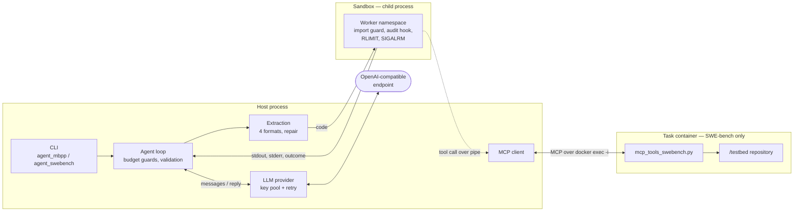
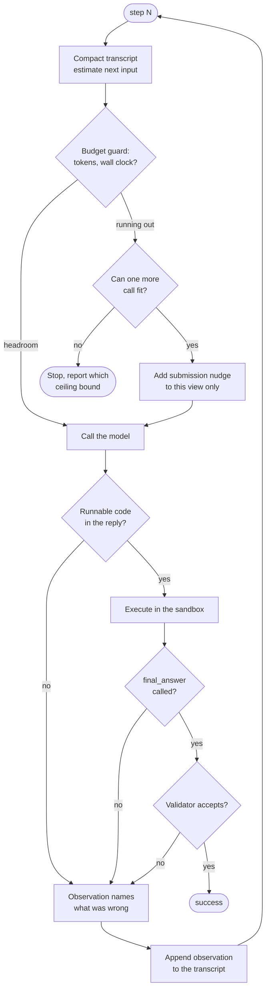
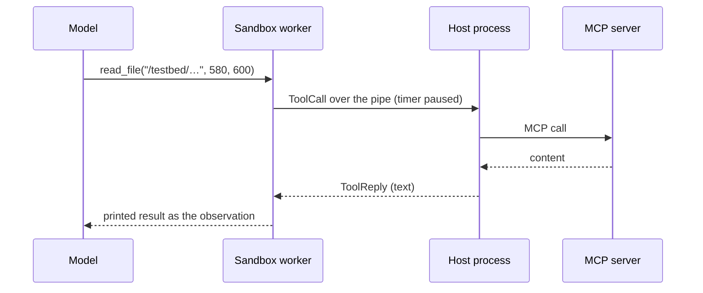

*This project has been created as part of the 42 curriculum by jbarthel, qbourine, epesnel.*

# Agent Smith

## Description

Agent Smith is an LLM agent harness that solves programming tasks by **writing Python, running it, and reading what happened**: the Thought → Code → Observation cycle. The model never emits a JSON tool call; it emits a code block, and that code calls tools as ordinary Python functions inside a restricted interpreter.

It targets two benchmarks:

| Benchmark | Task | Answer |
| --- | --- | --- |
| **MBPP** | write a function that satisfies hidden assertions | the source of the function |
| **SWE-bench** | fix a real bug in a real repository, inside the task's Docker image | a `git diff` patch |

The agent is provider-agnostic: any OpenAI-compatible endpoint works (Mistral, Groq, OpenRouter, or a local Ollama/vLLM server) by passing `--provider-url`. Each run produces a `solution.json` matching the evaluation contract, with per-step metrics: tokens, latency, endpoint, the code that ran, what the sandbox said.

Two properties drive most of the design:

- **A crash scores as an automatic fail**, so `run_task` never raises. Every failure path returns a valid result with `success=False` and a populated `error`.
- **Every ceiling is a hard limit**. iterations, cumulative input and output tokens, wall clock. The loop reserves budget for one last submission attempt rather than dying mid-thought.

## Instructions

**Requirements:** Python ≥ 3.10, [uv](https://docs.astral.sh/uv/), and Docker (SWE-bench only).

```bash
make install                 # uv venv + uv sync
cp .env.example .env         # then fill in one API key
make check                   # ruff + ruff format + mypy
```

Keys are discovered from the endpoint: `--provider-url https://api.mistral.ai/v1` looks for `MISTRAL_API_KEY`, then `MISTRAL_API_KEY_2…N` for the rotation pool. A provider absent from `models.json` needs no code change — only a URL.

**Run one MBPP task**

```bash
uv run python -m agent_mbpp \
  --task-file tests/fixtures/mbpp_tasks.json --output solution.json \
  --provider-url https://api.mistral.ai/v1 --model-name mistral-medium-latest
```

**Run one SWE-bench task** (pulls the task's image)

```bash
uv run python -m agent_swebench \
  --task-file benchmarks/runs/tasks/sympy__sympy-13480.json --output solution.json \
  --provider-url https://api.mistral.ai/v1 --model-name magistral-small-latest
```

`--model-name` and `--provider-url` fall back to `models.json`; `--env-file` and `--max-iterations` are also accepted.

**Explore the sandbox by hand** — the same interpreter the agent gets, as a REPL:

```bash
uv run sandbox --mcp-stdio "python mcp_tools_mbpp.py"
```

**Dump tasks and score solutions** (the moulinette, in `moulinette/`):

```bash
cd moulinette
uv run moulinette_eval dump swebench --task_id sympy__sympy-13480 --output /abs/path/task.json
uv run moulinette_eval validate swebench task.json solution.json
```

**Run a benchmark campaign** — the model × task matrix, resumable, one image resident at a time:

```bash
bash benchmarks/swe-matrix.sh              # TASKS=, MODELS=, OUT=, DROP_IMAGES= all overridable
```

## System architecture

Three isolation boundaries: the agent reasons in the **host process**, code runs in a **child process** with no network and a filtered namespace, and on SWE-bench the tools run in the **task's container** so they can touch the checked-out repository.



The child process holds **no sockets and no event loop**. When sandboxed code calls a tool, a stub puts a `ToolCall` on the pipe and blocks; the parent — which owns the live MCP client — performs the call and replies with rendered text. Only plain data crosses the boundary.

| Module | Responsibility |
| --- | --- |
| `agent/loop.py` | the iteration cycle, budget guards, answer validation |
| `agent/budget.py` | when to force a final submission, and whether one still fits |
| `agent/history.py` | compaction — old steps keep their code, lose their prose |
| `extraction/` | pull runnable Python out of four reply formats, repair what nearly parses |
| `llm/` | the single outbound HTTP path, key rotation, retry within a budget |
| `sandbox/` | the child process, its namespace, and its guards |
| `mcp/` | client, registry, and the wrappers that become functions in the namespace |
| `tools/` | the eleven tool implementations |
| `models/contract.py` | the `SolutionOutput` the evaluation reads |

## The agent loop

One iteration, from `agent/loop.py`:



What the diagram compresses:

- **The budget is measured, not assumed.** The guard calibrates billed tokens against its own estimate from the one pairing that is never a guess — what a call was billed versus what it was estimated at — and reserves the forced final call at the size the transcript will actually have reached.
- **Nothing ends on an unjudged answer.** `final_answer` is handed to a validator: MBPP runs the assertions, SWE-bench runs the task's evaluation script in the container. A refused submission becomes the next observation, so the model reads *why*. An unchanged resubmission is refused without being judged again — the verdict cannot differ, and re-running a container evaluation to learn that spends the clock.
- **Every failure speaks to the model.** A block that holds only comments, a reply cut off at the token cap, a sandbox restart that lost the namespace, output truncated at the size limit — each is a sentence saying what happened *and* what to do instead.
- **Compaction keeps the transcript affordable.** Older steps keep the code that ran and lose the reasoning that led there.

## Sandbox design

A restartable child process holding a **persistent namespace** — variables and functions survive across iterations, which is what lets a model build up state instead of resending it.

```
code ──> ImportGuard ──> AST escape scan ──> exec in filtered builtins
                                                │
                          SIGALRM (soft) ───────┤
                          join timeout (hard) ──┤──> ExecResult(outcome, stdout, stderr)
                          RLIMIT_AS ────────────┘
```

| Layer | What it stops |
| --- | --- |
| **Import guard** | anything outside the allowlist (`math`, `collections`, `itertools`, `re`, `json`, …) |
| **AST scan** | `__subclasses__`, `__globals__`, `__init_subclass__` and friends — the classic escapes, refused before execution |
| **Guarded `getattr`** | the same names reached dynamically at runtime |
| **Audit hook** | writes outside the allowed directories, socket creation, subprocess spawning |
| **`RLIMIT_AS` / `RLIMIT_DATA`** | runaway allocation, reported as `memory_limit` |
| **`SIGALRM` + join deadline** | slow code (`soft_timeout`, partial output kept) and wedged code (`hard_timeout`, worker replaced) |

Nine distinct `Outcome` values, so the loop can say what happened rather than "it failed". Output is capped at 8 000 characters per stream with an inline marker. A crashed worker is replaced transparently, and the next observation tells the model its namespace is gone.

Two details that came from real traces rather than from design:

- **Bare expressions echo, as in a REPL.** A tool returns its result rather than printing it, so a turn that forgot `print()` executed, produced the output, and showed the model nothing. Echoing took silent turns from 13 to 0 across a five-model pass.
- **`final_answer` is a control-flow signal**, not a return value — it raises inside the worker and is carried out in the `ExecResult`, so a submission cannot be mistaken for ordinary output.

## Tool implementation

Tools are **MCP tools that arrive as Python functions**. At startup the client lists the server's tools; `mcp/wrapper.py` builds a real function per definition — correct signature, docstring, positional binding against the published schema — and injects it into the sandbox namespace. The model writes `read_file("/testbed/sympy/core/mul.py", 580, 600)`, not a JSON envelope.



Eleven tools on SWE-bench, one on MBPP (`run_tests`):

| Group | Tools |
| --- | --- |
| Read | `read_file`, `list_files`, `search_code`, `search_code_with_context`, `search_function_or_class_definition_in_code`, `find_references` |
| Write | `edit_file`, `write_file` |
| Run | `run_tests`, `run_command` |
| Submit | `get_patch` |

Implementation notes that mattered in practice:

- **The clock stops during a tool call.** The worker's execution timer is paused around the IPC round-trip, so a slow `run_tests` cannot consume the code's own timeout.
- **Argument errors are sentences, not tracebacks.** A mismatched call answers `Error: Invalid arguments for 'edit_file': missing a required argument: 'new_str'`. The previous eight-frame `inspect` traceback caused one model to repeat the identical malformed call until its output budget was gone.
- **Paths are normalised to the testbed**, because the model writes `/testbed/...` — that is what the task statement shows it.
- **`run_tests` parses the evaluation script's output** into structured pass/fail counts, and runs it under bash: under `/bin/sh` (dash) the script dies on `set -o pipefail`, which silently refused *every* submission in one ablation pass.

## Benchmark results and analysis

11 models × 7 SWE-bench tasks, at the subject's SWE-bench ceilings (30 iterations, 300 000 input tokens, 10 000 output tokens, 900 s), free tiers only.

| Model | Provider | Solved | Total input tokens | Total output tokens | Total wall-clock |
|---|---|---|---|---|---|
| `mistral-medium-latest` | Mistral | 7/7 | 447,098 | 3,539 | 947s |
| `magistral-small-latest` | Mistral | 7/7 | 520,328 | 6,006 | 388s |
| `qwen/qwen3.6-27b` | Groq | 7/7 | 101,022 | 4,970 | 602s |
| `qwen/qwen3-235b-a22b-2507` | OpenRouter | 6/7 | 342,042 | 2,420 | 225s |
| `gemini-3.1-flash-lite` | Google | 6/7 | 492,995 | 7,337 | 413s |
| `codestral-2508` | Mistral | 5/7 | 491,593 | 3,333 | 125s |
| `llama-3.3-70b-versatile` | Groq | 5/7 | 77,344 | 813 | 232s |
| `devstral-medium-latest` | Mistral | 4/7 | 582,465 | 4,503 | 1,025s |
| `poolside/laguna-s-2.1` | Poolside | 3/7 | 692,208 | 9,811 | 895s |
| `llama-3.1-8b-instant` | Groq | 2/7 | 319,054 | 4,769 | 3,008s |
| `nvidia/nemotron-nano-9b-v2:free` | OpenRouter | 2/7 | 11,597 | 3,309 | 401s |

MBPP, measured over the whole 257-task pool rather than a sample: **238/257** with `mistral-medium-latest`, against 215 for `magistral-small-latest` and 207 for `codestral-2508`.

**What the numbers say.**

**Three models tie at 7/7** — `mistral-medium-latest`, `magistral-small-latest` and `qwen/qwen3.6-27b` — so capability does not pick the default. **SWE-bench runs on `magistral-small-latest`**, the fastest of the three end to end and the one whose provider gives us two keys against a per-second limit, where throttling arrives as delay the retry budget can spend rather than as a wall.

**`qwen/qwen3.6-27b` (Groq) is the cheapest by a wide margin** — the same 7/7 on 101,022 input tokens, a fifth of what `magistral-small-latest` spends — and would be the better choice on the numbers alone with a second key behind it.

**MBPP runs on `mistral-medium-latest`**, which the pool measures highest. The two benchmarks wanting different models is why `models.json` carries a default per benchmark.

Full matrix, provider reliability, intermediary metrics and ablations: [`BENCHMARK_REPORT.md`](BENCHMARK_REPORT.md). Backing `solution.json` files under `benchmarks/runs/` (SWE-bench) and `benchmarks/mbpp/` (MBPP).

## Resources

https://www.anthropic.com/engineering/building-effective-agents

**Use of AI.** AI was used to provide blueprints and general directions.
